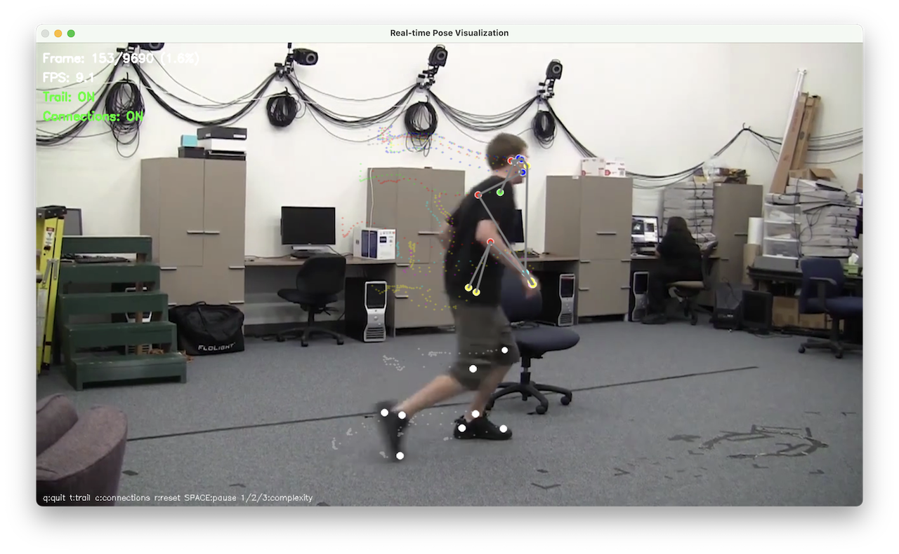

# Gait Analysis System

A comprehensive markerless gait analysis system using computer vision and machine learning techniques for analyzing human walking patterns.

## 🎯 Overview

This system provides a complete pipeline for markerless gait analysis using:

- **Computer Vision**: Real-time pose estimation with MediaPipe
- **Machine Learning**: Temporal Convolutional Networks (TCN) for gait pattern analysis
- **Data Processing**: Advanced preprocessing and feature extraction
- **Visualization**: Real-time pose visualization with trail effects

## ✨ Key Features

- **🔄 Unified Pose Estimation**: Extensible architecture supporting multiple pose estimation backends
- **🧠 TCN Architecture**: Temporal sequence modeling for gait analysis
- **📊 Advanced Analytics**: Gait event detection, phase analysis, and performance metrics
- **🎨 Real-time Visualization**: Interactive pose visualization with trail effects
- **🔧 Modular Design**: Easy to extend with new pose models and analysis methods
- **📈 Cross-validation**: Robust evaluation pipeline with comprehensive metrics
- **📁 Organized Outputs**: All results centralized in `outputs/` directory

## 🏗️ System Architecture

### Extensible Pose Processing

The unified pose processor manager makes it easy to add new pose estimation models:

1. Create a new processor class inheriting from `PoseProcessor`
2. Implement required abstract methods
3. Add the model to the `AVAILABLE_MODELS` dictionary
4. Update the `create_processor` method

### Project Structure

```
gait_analysis/
├── core/                                       # Core system modules
│   ├── utils/                                  # Utility modules
│   │   ├── constants.py                        # Core constants
│   │   ├── config.py                           # Configuration management
│   │   └── logging_config.py                   # Logging configuration
│   ├── pose_processor_manager.py               # Unified pose processor manager
│   ├── mediapipe_integration.py                # MediaPipe pose estimation
│   ├── gait_data_preprocessing.py              # Data preprocessing and feature extraction
│   ├── gait_training.py                        # Training and evaluation module
│   └── tcn_gait_model.py                       # Temporal Convolutional Network model
├── usecases/                                   # Use case implementations
│   ├── gait_analysis/                          # Main gait analysis use case
│   │   ├── features/                           # Feature-specific implementations
│   │   │   └── realtime_pose_visualization.py  # Real-time visualization
│   │   ├── utils.py                            # Utilities for quick analysis
│   │   └── main_gait_analysis.py               # Main pipeline orchestrator
│   └── testing/                                # Testing and validation
│       ├── test_pose_models.py                 # Pose model testing and comparison
│       └── test_system.py                      # System testing and validation
├── scripts/                                    # Utility scripts
│   ├── pose_model_comparison.py                # Pose model comparison tool
│   └── run_gait_analysis.py                    # Gait analysis runner
├── configs/                                    # Configuration files
│   ├── default.json                            # Default configuration
│   └── gait_analysis.json                      # Configuration for pose models
├── docs/                                       # Documentation
│   ├── visualizations/                         # Generated visualizations
│   ├── README_RealTime_Visualization.md        # Real-time visualization docs
│   ├── README_TCN_Gait_Analysis.md             # TCN system documentation
│   ├── README_Installation.md                  # Installation guide
│   └── README_Changelog.md                     # Project changelog and history
├── archive/                                    # Legacy scripts (see archive/README.md)
├── data/                                       # Input data directory
│   └── models/                                 # Trained models
├── videos/                                     # Video files directory
│   ├── raw/                                    # Raw video files
│   └── sneak/                                  # Sneak gait videos
└── outputs/                                    # Output results directory
    ├── gait_analysis/                          # Gait analysis results
    ├── mediapipe/                              # MediaPipe outputs
    ├── test_results/                           # Test results
    ├── logs/                                   # Application logs
    └── models/                                 # Trained models
    └── visualizations/                         # Generated visualizations
```

## 🚀 Quick Start

### 1. Setup Environment

**On macOS/Linux:**

```bash
./setup_environment.sh
```

**On Windows:**

```cmd
setup_environment.bat
```

### 2. Activate Virtual Environment

```bash
source .venv/bin/activate  # macOS/Linux
# or
.venv\Scripts\activate     # Windows
```

### 3. Test Installation

```bash
# Test the complete system
python3 usecases/testing/test_system.py

# Test pose models specifically
python3 usecases/testing/test_pose_models.py

# Show available models
python3 scripts/pose_model_comparison.py --info
```

### 4. Run Analysis

```bash
# Basic gait analysis with MediaPipe
python3 usecases/gait_analysis/main_gait_analysis.py \
    --videos videos/raw/sample.mp4 \
    --output outputs/gait_analysis/

# Pose detection only
python3 usecases/gait_analysis/main_gait_analysis.py \
    --videos videos/raw/sample.mp4 \
    --pose-detection-only

# With real-time visualization
python3 usecases/gait_analysis/main_gait_analysis.py \
    --videos videos/raw/sample.mp4 \
    --with-visualization
```

## 🎯 Pose Estimation Models

### Supported Frameworks

| Framework     | Status             | Notes                              |
| ------------- | ------------------ | ---------------------------------- |
| **MediaPipe** | ✅ Implemented     | Default, actively used             |
| **OpenPose**  | ⚠️ Legacy          | Code in `archive/`, not integrated |
| **YOLO-Pose** | ❌ Not implemented | Architecture ready for integration |
| **MMPose**    | ❌ Not implemented | Architecture ready for integration |
| **ViTPose**   | ❌ Not implemented | Architecture ready for integration |

### Current Limitations

- **Single-person detection only**: The system is currently configured with `num_poses=1`, detecting only one person per frame. Multi-person detection is supported by MediaPipe but not yet implemented in this codebase.

### MediaPipe (Default)

- **Speed**: Fast, real-time processing
- **Accuracy**: Good for most applications
- **Resource Usage**: Low, works on CPU
- **Best For**: Real-time applications, mobile/edge devices
- **Landmarks**: 33 pose landmarks, converted to BODY_25 format (25 keypoints)

### Adding New Models

The system architecture is designed to easily support additional pose estimation models:

1. Create a new processor class that inherits from `PoseProcessor` abstract base class
2. Implement the required abstract methods (`process_video`, `process_webcam`, `cleanup`)
3. Add the model to the `AVAILABLE_MODELS` dictionary in `PoseProcessorManager`
4. Update the `create_processor` method to handle the new model type

See `core/pose_processor_manager.py` for the extensible architecture and `core/mediapipe_integration.py` for an implementation example.

### Model Comparison

```bash
# Compare available models on the same video
python3 scripts/pose_model_comparison.py --video videos/raw/sample.mp4 --compare

# Process with specific model
python3 usecases/gait_analysis/main_gait_analysis.py \
    --videos videos/raw/sample.mp4 \
    --pose-model mediapipe
```

## 🎨 Real-time Pose Visualization

The system includes an interactive real-time pose visualization tool that displays pose keypoints as colored dots with trail effects.

### Example Visualizations




### Quick Demo

```bash
# Basic visualization with trail effect
python3 usecases/gait_analysis/features/realtime_pose_visualization.py videos/raw/sample.mp4

# Show confidence values
python3 usecases/gait_analysis/features/realtime_pose_visualization.py videos/raw/sample.mp4 --show-confidence

# Fast performance mode
python3 usecases/gait_analysis/features/realtime_pose_visualization.py videos/raw/sample.mp4 --model-complexity 0 --no-trail
```

### Interactive Controls

- **'q'**: Quit visualization
- **'t'**: Toggle trail effect
- **'c'**: Toggle connections
- **'r'**: Reset trail
- **SPACE**: Pause/resume
- **'1', '2', '3'**: Change model complexity

## 📊 Output Structure

All results are organized in the `outputs/` directory:

```
outputs/
├── gait_analysis/                      # Main gait analysis results
│   ├── cv_metrics.json                 # Cross-validation metrics
│   ├── fold_scores.json                # Per-fold performance
│   ├── training_histories.json         # Training curves data
│   ├── classification_report.txt       # Detailed classification report
│   ├── confusion_matrix.png            # Confusion matrix visualization
│   ├── training_curves.png             # Training curves plot
│   └── detailed_results.json           # Complete results summary
├── mediapipe/                          # MediaPipe pose detection outputs
├── test_results/                       # Testing and validation results
├── logs/                               # Application logs
├── visualizations/                     # Charts, graphs, and visual outputs
└── models/                             # Trained models and artifacts
```

## 📚 Documentation

- **[Real-time Visualization](docs/README_RealTime_Visualization.md)**: Interactive pose visualization guide
- **[TCN Gait Analysis](docs/README_TCN_Gait_Analysis.md)**: Comprehensive TCN system documentation
- **[Installation Guide](docs/README_Installation.md)**: Detailed setup instructions
- **[Core Modules](core/README_CoreModules.md)**: Core system modules documentation
- **[Changelog](docs/README_Changelog.md)**: Project history and changes
- **[Archive](archive/README.md)**: Legacy scripts and migration notes

## 🔧 Configuration

The system uses JSON configuration files for customization:

```json
{
  "pose_model": "mediapipe",
  "task_type": "phase_detection",
  "num_classes": 4,
  "num_filters": 64,
  "kernel_size": 3,
  "num_blocks": 4,
  "dropout_rate": 0.2,
  "learning_rate": 0.001,
  "epochs": 100,
  "batch_size": 32
}
```

## 🤝 Contributing

1. Fork the repository
2. Create a feature branch
3. Make your changes
4. Add tests for new functionality
5. Submit a pull request

## 📄 License

This project is licensed under the MIT License - see the [LICENSE](LICENSE) file for details.

## 🙏 Acknowledgments

- MediaPipe team for the pose estimation framework
- TensorFlow/Keras community for the deep learning framework
- OpenCV community for computer vision tools

---

**Note**: Legacy scripts from the initial development phase have been moved to the `archive/` directory. See [archive/README.md](archive/README.md) for details about the archived files and migration notes.
